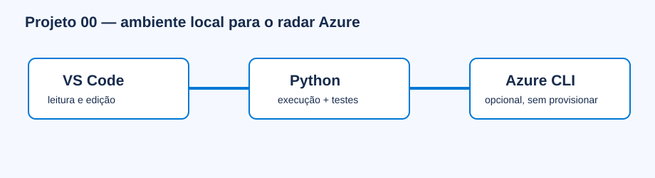

# Projeto 00 — Configuração do ambiente Azure

> Faça este projeto antes dos projetos `001` em diante. Ele prepara apenas o ambiente local e não cria recursos Azure.



## O que você aprenderá

Você instalará e verificará VS Code, Python e Git. A Azure CLI é apresentada como ferramenta opcional para projetos futuros. Ao final, saberá abrir a pasta correta, criar um ambiente virtual, executar módulos, rodar testes e reconhecer arquivos que nunca devem ser versionados.

## Ferramentas, bibliotecas e recursos utilizados

| Item | Obrigatório? | Função | Verificação |
|---|---:|---|---|
| VS Code | Recomendado | Editor, terminal integrado e leitura de Markdown | `code --version` |
| Python 3.10+ | Sim | Executa código e testes locais | `python3 --version` |
| `venv` e `pip` | Sim quando houver dependências | Isolam bibliotecas por projeto | `python3 -m pip --version` |
| Git | Recomendado | Inspeciona alterações locais; publicar é proibido sem aprovação | `git --version` |
| Azure CLI | Não | Autenticação opcional em projetos que declarem integração | `az version` |
| Azure Account extension | Não neste projeto | Navegação por recursos no VS Code | Tela Extensions do VS Code |

## Passo a passo detalhado

### 1. Instale o VS Code

Baixe pelo [site oficial](https://code.visualstudio.com/Download), instale e abra o aplicativo. Em **Extensions**, procure `Python` da Microsoft e instale. A extensão Azure Account é opcional; não faça login agora.

### 2. Confirme Python e Git

Abra **Terminal → New Terminal** no VS Code e execute:

```bash
python3 --version
git --version
```

Python deve ser 3.10 ou superior. Git ausente não impede os exercícios, mas dificulta revisar alterações.

### 3. Abra a pasta do radar

```bash
cd "caminho/para/azure-data-engineering-projects"
code .
cd 000-configuracao-ambiente
```

Sempre execute um projeto a partir da própria pasta; isso evita erros de caminho em `data/` e `src/`.

### 4. Crie um ambiente virtual

```bash
python3 -m venv .venv
source .venv/bin/activate
python3 -m pip install --upgrade pip
```

O prefixo `(.venv)` deve aparecer no terminal. Este projeto usa apenas a biblioteca padrão, portanto não instala pacotes extras.

### 5. Valide o ambiente

```bash
python3 -m src.check_environment
python3 -m unittest discover -s tests -v
cat data/output/environment.json
```

`python_supported` deve ser `true`. `optional_cloud_ready` pode ser `false`: a Azure CLI não é necessária para a execução local.

### 6. Azure CLI opcional

Instale somente quando um projeto explicar por que precisa dela, usando a [documentação oficial](https://learn.microsoft.com/en-us/cli/azure/install-azure-cli). `az login` autentica, mas não cria recursos sozinho. Não use chaves ou senhas em arquivos.

## Site local com MkDocs

O **MkDocs** transforma arquivos Markdown em um site navegável; o tema **Material for MkDocs** adiciona busca, navegação e cópia de código. Eles são opcionais e servem somente a documentação local.

```bash
cd "caminho/para/azure-data-engineering-projects"
source .venv/bin/activate
python3 -m pip install -r requirements-docs.txt
python3 -m mkdocs serve --config-file mkdocs.yml
```

Abra o endereço exibido no terminal. `Ctrl+C` encerra o servidor. O comando não publica o site. Para gerar HTML estático local, use `python3 -m mkdocs build --strict --config-file mkdocs.yml`; a saída ignorada pelo Git fica em `site-local/Azure`.

Se `No module named mkdocs` aparecer, confirme que a `.venv` da raiz está ativa e repita a instalação do arquivo `requirements-docs.txt`.

## Conceitos de Engenharia de Dados aplicados

Reprodutibilidade, isolamento de dependências, execução local primeiro, segurança de credenciais e validação automatizada do ambiente.

## Pré-requisitos e possíveis custos

Computador com terminal e permissão para instalar software. VS Code, Python, Git e Azure CLI são gratuitos. Serviços Azure podem gerar custos, mas este projeto não usa assinatura nem provisiona nada.

## O que foi validado

O script registra versões e caminhos das ferramentas sem coletar credenciais. O teste confirma o contrato do relatório.

## Pratique e registre evidência

1. Execute o checker com a `.venv` ativa.
2. Anote a versão do Python e quais ferramentas opcionais foram encontradas.
3. Feche o terminal, abra outro e reative a `.venv`.
4. Guarde como evidência o resultado do teste `OK`; não versione o relatório de ambiente.

## Solução de problemas

| Sintoma | Causa provável | Correção |
|---|---|---|
| `python3: command not found` | Python não instalado/no PATH | Instale pelo site oficial e reabra o terminal |
| `code: command not found` | Comando Shell do VS Code ausente | No VS Code, use Command Palette → “Shell Command: Install 'code' command” |
| `No module named src` | Terminal fora da pasta do projeto | Execute `pwd` e volte para `000-configuracao-ambiente` |
| `.venv` não ativa | Shell ou caminho diferente | No macOS/Linux use `source .venv/bin/activate` |
| `az` ausente | CLI opcional não instalada | Continue localmente ou siga a documentação oficial quando necessário |

## Checklist de conclusão

- [ ] Abri a pasta Azure no VS Code.
- [ ] Confirmei Python 3.10+.
- [ ] Criei e ativei `.venv`.
- [ ] Executei o checker e o teste.
- [ ] Entendi que Azure CLI e autenticação são opcionais.
- [ ] Não criei recursos, não publiquei e não executei `git push`.

## Tecnologias relacionadas ainda não utilizadas

Sem SDK Azure, subscription, Service Principal, Managed Identity, Terraform, Bicep, Docker, deploy ou CI/CD.

## Referências oficiais

- [VS Code: primeiros passos](https://code.visualstudio.com/docs/getstarted/getting-started)
- [Python no VS Code](https://code.visualstudio.com/docs/python/python-tutorial)
- [Ambientes virtuais Python](https://docs.python.org/3/library/venv.html)
- [Instalar Azure CLI](https://learn.microsoft.com/en-us/cli/azure/install-azure-cli)

Rascunho local; nada foi publicado.
