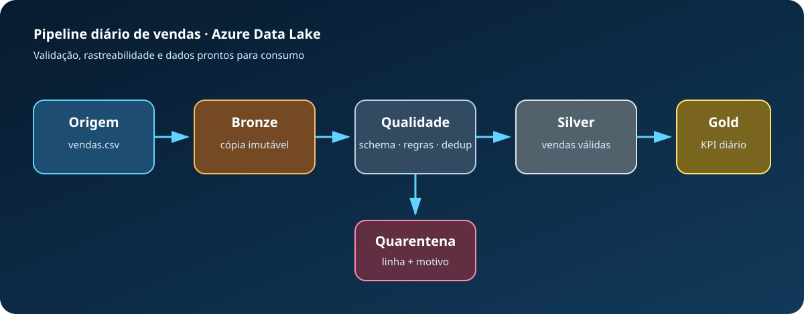

# Pipeline Medalhão de Vendas no Azure

> Projeto 001 · nível iniciante · Python + Azure Blob Storage/ADLS · batch

Um pipeline pequeno, mas próximo do trabalho real: preserva a entrada na camada **bronze**, valida e deduplica vendas na **silver**, separa problemas em **quarentena** e produz receita diária na **gold**. Ele roda totalmente local e só acessa o Azure quando você solicita explicitamente.



## O problema

Arquivos de vendas frequentemente chegam com duplicidades, quantidades inválidas e preços incorretos. Carregá-los diretamente em um relatório distorce indicadores. Este projeto introduz três práticas essenciais:

- cópia rastreável do dado original;
- contrato de schema e regras de qualidade;
- saída curada e agregada para consumo analítico.

## Execute localmente

Pré-requisito: Python 3.10 ou superior. A execução local usa apenas a biblioteca padrão.

```bash
python3 -m src.pipeline
```

O exemplo contém sete linhas: quatro válidas e três rejeitadas (duplicidade, quantidade zero e preço negativo). Confira:

```bash
cat data/gold/vendas_diarias.csv
cat data/quarantine/vendas_rejeitadas.csv
cat data/run-report.json
```

Teste automatizado:

```bash
python3 -m unittest discover -s tests -v
```

## Envie para uma Storage Account (opcional)

O modo Azure usa autenticação sem senha com `DefaultAzureCredential`. Faça login pela Azure CLI e garanta que sua identidade tenha a função **Storage Blob Data Contributor** na conta.

```bash
python3 -m venv .venv
source .venv/bin/activate
pip install -r requirements.txt
az login
python3 -m src.pipeline --upload-azure NOME_DA_STORAGE_ACCOUNT
```

O comando cria, se necessário, os containers `bronze`, `silver`, `gold` e `quarantine`. Não há provisionamento automático, evitando criar recursos ou custos por engano.

## Regras implementadas

| Regra | Destino quando falha |
|---|---|
| Todas as seis colunas obrigatórias estão preenchidas | Quarentena |
| Data no padrão ISO `AAAA-MM-DD` | Quarentena |
| Quantidade inteira e maior que zero | Quarentena |
| Preço decimal e maior que zero | Quarentena |
| `pedido_id` único dentro do lote | Quarentena |

O hash SHA-256 do arquivo identifica o lote. Reprocessar o mesmo conteúdo não cria outra cópia bronze.

## Ferramentas e recursos utilizados

| Ferramenta ou recurso | Uso no projeto |
|---|---|
| Python 3 | Implementação e execução do pipeline batch |
| Biblioteca padrão do Python | Leitura de CSV, validação, agregação, geração de JSON e manipulação de arquivos |
| Azure Blob Storage / ADLS | Destino opcional das camadas de dados |
| `azure-storage-blob` | Criação dos containers e envio dos arquivos ao Azure |
| `azure-identity` | Integração com a identidade utilizada na autenticação |
| `DefaultAzureCredential` | Autenticação sem armazenar senha ou chave no código |
| Azure CLI | Login local por meio do comando `az login` |
| Microsoft Entra ID e Azure RBAC | Controle de acesso com a função `Storage Blob Data Contributor` |
| CSV | Formato simples da primeira versão, fácil de abrir e inspecionar |
| SHA-256 | Identificação determinística do lote e idempotência da camada bronze |
| `unittest` | Testes automatizados sem dependências adicionais |
| SVG | Diagrama de arquitetura versionável e exibido pelo GitHub |
| `.gitignore` | Proteção contra versionamento de credenciais, ambiente virtual e resultados locais |

O pipeline local funciona apenas com a biblioteca padrão do Python. Os pacotes do Azure somente são necessários quando a opção `--upload-azure` é utilizada.

## Conceitos de engenharia de dados aplicados

- **Arquitetura medalhão:** separação progressiva entre dados brutos, validados e preparados para consumo.
- **Data lake:** organização dos arquivos em zonas com propósitos diferentes.
- **Ingestão batch:** processamento de um arquivo como um lote delimitado.
- **Contrato de dados:** verificação das colunas e do schema esperado antes da transformação.
- **Qualidade de dados:** validação de campos obrigatórios, tipos, quantidades e preços.
- **Deduplicação:** manutenção de apenas um registro para cada `pedido_id` dentro do lote.
- **Quarentena:** preservação dos registros rejeitados junto ao motivo da falha.
- **Agregação analítica:** produção de pedidos, itens e receita agrupados por dia.
- **Rastreabilidade:** cópia do dado original e relatório JSON de cada execução.
- **Idempotência:** reprocessar o mesmo conteúdo não gera outra cópia bronze.
- **Segurança sem senha:** uso da identidade do Azure em vez de segredos gravados no código.

## Tecnologias relacionadas ainda não utilizadas

Esta primeira versão não utiliza Azure Data Factory, Azure Databricks, Microsoft Fabric, Apache Spark, Parquet ou Delta Lake. Esses recursos aparecem como evoluções futuras, mantendo o projeto inicial simples, gratuito para execução local e adequado a quem está começando.

## Como isso evolui no Azure

1. Trocar o arquivo manual por **Azure Data Factory Copy Activity**.
2. Armazenar as camadas em **ADLS Gen2** com partições por data.
3. Converter silver e gold para **Parquet** ou **Delta Lake**.
4. Executar as transformações com **Azure Databricks** ou **Microsoft Fabric**.
5. Adicionar métricas e alertas no **Azure Monitor**.

## Referências oficiais

- [O que é um data lake e suas camadas bronze, silver e gold](https://learn.microsoft.com/en-us/azure/architecture/data-guide/scenarios/data-lake)
- [Início rápido do Azure Blob Storage com Python](https://learn.microsoft.com/en-us/azure/storage/blobs/storage-quickstart-blobs-python)
- [Biblioteca Azure Storage Blobs para Python](https://learn.microsoft.com/en-us/python/api/overview/azure/storage-blob-readme?view=azure-python)
- [Autorização com Microsoft Entra ID para blobs](https://learn.microsoft.com/en-us/azure/storage/blobs/authorize-access-azure-active-directory)

## Política de publicação

Este diretório é somente um rascunho local. Não há workflow de release, deploy ou publicação. A criação do repositório remoto e qualquer `git push` devem acontecer apenas após revisão e aprovação manual do responsável.

## O que foi feito neste projeto

Foi construída uma versão local, segura e pequena do problema descrito no início do README. Os dados de exemplo permitem acompanhar entrada, regra aplicada e saída sem depender de uma conta Azure. A integração cloud citada representa a evolução arquitetural; ela não é executada automaticamente.

## Passo a passo detalhado

### 1. Prepare o ambiente

Conclua primeiro o [Projeto 00 — Configuração do ambiente](../000-configuracao-ambiente/README.md). Ele explica VS Code, Python, `.venv`, Git e a CLI opcional desta cloud. Depois, no terminal do VS Code, entre nesta pasta:

```bash
cd "caminho/para/azure-data-engineering-projects"
cd "001-medallion-vendas"
```

Confirme que `pwd` termina em `001-medallion-vendas`. Os caminhos relativos usados pelo código dependem disso.

### 2. Reconheça os arquivos antes de executar

- Abra `README.md` para entender problema, ferramentas e custos.
- Abra `data/` para conhecer os dados fictícios de entrada e, quando existir, a saída esperada.
- Abra `src/` e localize a função principal antes de modificá-la.
- Abra `tests/` e relacione cada cenário ao comportamento esperado.
- Abra `docs/arquitetura.svg` no Preview do VS Code para acompanhar o fluxo.

### 3. Execute a implementação original

Use os comandos documentados neste projeto. O primeiro roteiro executável é:

```bash
python3 -m src.pipeline
```

Leia toda a saída. Exit code `0` significa execução normal; quando o README declara achados intencionais, outro código pode representar uma validação que bloqueou corretamente um caso inseguro.

### 4. Valide de forma independente

```bash
python3 -m unittest discover -s tests -v
```

Não considere apenas `OK`: leia o nome de cada teste e confirme qual regra ele prova. Depois, inspecione `data/output/` ou os destinos indicados anteriormente neste README.

### 5. Faça uma alteração controlada

Altere um único valor nos dados de exemplo e preveja o resultado. Execute novamente, compare a saída e desfaça sua alteração manual caso ela seja apenas um experimento. Não use dados pessoais, credenciais ou recursos reais.

### 6. Registre evidência de aprendizagem

Anote o comando usado, a entrada alterada, o resultado observado, o teste que protege a regra e uma frase explicando como o serviço Azure participaria em produção. Capturas de tela isoladas não substituem essa evidência técnica.

## Solução de problemas

| Sintoma | Causa provável | Como resolver |
|---|---|---|
| `No module named src` | Terminal aberto na pasta errada | Execute `pwd` e entre na raiz deste projeto |
| Arquivo em `data/` não encontrado | Comando executado de outra pasta | Repita o `cd` mostrado no passo 1 |
| Versão ou sintaxe incompatível | Python anterior a 3.10 | Volte ao projeto 00 e selecione o interpretador correto no VS Code |
| Comando retorna código não zero | Pode haver achado didático intencional | Leia a saída e “O que foi validado” antes de tratar como defeito |
| Saída antiga ou inesperada | Resultado de execução anterior | Confira parâmetros; resultados locais não devem ser publicados |
| CLI cloud pede login ou permissão | A etapa local foi ultrapassada | Interrompa; autenticação só é opcional quando este README a explica |

## Checklist de conclusão

- [ ] Concluí o projeto 00 e abri esta pasta no VS Code.
- [ ] Consigo explicar o problema e a função de cada ferramenta listada.
- [ ] Li dados, código, testes e diagrama antes de executar.
- [ ] Executei o exemplo local e interpretei a saída.
- [ ] Executei os testes e sei qual regra cada um protege.
- [ ] Fiz uma alteração controlada usando somente dados fictícios.
- [ ] Registrei evidência e uma conclusão técnica.
- [ ] Não criei recursos pagos, não fiz deploy, não publiquei e não executei `git push`.

## Pré-requisitos consolidados

Python 3.10+ e conclusão do projeto 00 desta cloud. Dependências adicionais, autenticação, permissões e custos opcionais continuam descritos nas seções específicas acima; a execução local não exige criar recursos cloud.

Nada foi publicado; este conteúdo permanece como rascunho local para revisão manual.
