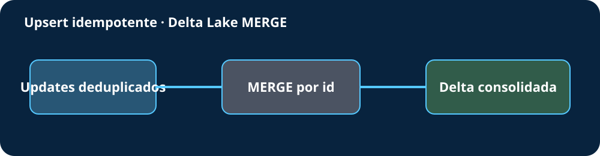

# Upsert idempotente com Delta Lake

> Azure 009 · intermediário · Azure Databricks

Simula um `MERGE`: deduplica o lote pela versão mais recente, atualiza IDs existentes e insere novos.



## Executar
```bash
python3 -m src.merge
python3 -m unittest discover -s tests -v
```

## Ferramentas e conceitos
| Item | Função |
|---|---|
| Python/CSV | Simulação local |
| Azure Databricks | Compute futuro |
| Delta Lake `MERGE` | Upsert ACID |
| Chave e `updated_at` | Match e resolução de duplicidade |
| `unittest`/SVG | Validação e diagrama |

Aplica deduplicação, idempotência, insert/update e proteção contra atualização antiga. Requer apenas Python 3.10+ e custa zero localmente; Databricks e storage podem gerar custos. Foram validados um insert, um update e três linhas finais.

## Tecnologias relacionadas ainda não utilizadas
Sem Spark, tabela Delta real, transaction log, schema evolution, delete, Unity Catalog ou deploy.

## Referências oficiais
- [Upsert com MERGE](https://learn.microsoft.com/en-us/azure/databricks/delta/merge)
- [Tutorial Delta Lake](https://learn.microsoft.com/en-us/azure/databricks/delta/tutorial)

Rascunho local; nada foi publicado ou implantado.

## O que foi feito neste projeto

Foi construída uma versão local, segura e pequena do problema descrito no início do README. Os dados de exemplo permitem acompanhar entrada, regra aplicada e saída sem depender de uma conta Azure. A integração cloud citada representa a evolução arquitetural; ela não é executada automaticamente.

## Passo a passo detalhado

### 1. Prepare o ambiente

Conclua primeiro o [Projeto 00 — Configuração do ambiente](../000-configuracao-ambiente/README.md). Ele explica VS Code, Python, `.venv`, Git e a CLI opcional desta cloud. Depois, no terminal do VS Code, entre nesta pasta:

```bash
cd "caminho/para/azure-data-engineering-projects"
cd "009-delta-merge-upsert"
```

Confirme que `pwd` termina em `009-delta-merge-upsert`. Os caminhos relativos usados pelo código dependem disso.

### 2. Reconheça os arquivos antes de executar

- Abra `README.md` para entender problema, ferramentas e custos.
- Abra `data/` para conhecer os dados fictícios de entrada e, quando existir, a saída esperada.
- Abra `src/` e localize a função principal antes de modificá-la.
- Abra `tests/` e relacione cada cenário ao comportamento esperado.
- Abra `docs/arquitetura.svg` no Preview do VS Code para acompanhar o fluxo.

### 3. Execute a implementação original

Use os comandos documentados neste projeto. O primeiro roteiro executável é:

```bash
python3 -m src.merge
python3 -m unittest discover -s tests -v
```

Leia toda a saída. Exit code `0` significa execução normal; quando o README declara achados intencionais, outro código pode representar uma validação que bloqueou corretamente um caso inseguro.

### 4. Valide de forma independente

```bash
python3 -m unittest discover -s tests -v
```

Não considere apenas `OK`: leia o nome de cada teste e confirme qual regra ele prova. Depois, inspecione `data/output/` ou os destinos indicados anteriormente neste README.

### 5. Faça uma alteração controlada

Altere um único valor nos dados de exemplo e preveja o resultado. Execute novamente, compare a saída e desfaça sua alteração manual caso ela seja apenas um experimento. Não use dados pessoais, credenciais ou recursos reais.

### 6. Registre evidência de aprendizagem

Anote o comando usado, a entrada alterada, o resultado observado, o teste que protege a regra e uma frase explicando como o serviço Azure participaria em produção. Capturas de tela isoladas não substituem essa evidência técnica.

## Solução de problemas

| Sintoma | Causa provável | Como resolver |
|---|---|---|
| `No module named src` | Terminal aberto na pasta errada | Execute `pwd` e entre na raiz deste projeto |
| Arquivo em `data/` não encontrado | Comando executado de outra pasta | Repita o `cd` mostrado no passo 1 |
| Versão ou sintaxe incompatível | Python anterior a 3.10 | Volte ao projeto 00 e selecione o interpretador correto no VS Code |
| Comando retorna código não zero | Pode haver achado didático intencional | Leia a saída e “O que foi validado” antes de tratar como defeito |
| Saída antiga ou inesperada | Resultado de execução anterior | Confira parâmetros; resultados locais não devem ser publicados |
| CLI cloud pede login ou permissão | A etapa local foi ultrapassada | Interrompa; autenticação só é opcional quando este README a explica |

## Checklist de conclusão

- [ ] Concluí o projeto 00 e abri esta pasta no VS Code.
- [ ] Consigo explicar o problema e a função de cada ferramenta listada.
- [ ] Li dados, código, testes e diagrama antes de executar.
- [ ] Executei o exemplo local e interpretei a saída.
- [ ] Executei os testes e sei qual regra cada um protege.
- [ ] Fiz uma alteração controlada usando somente dados fictícios.
- [ ] Registrei evidência e uma conclusão técnica.
- [ ] Não criei recursos pagos, não fiz deploy, não publiquei e não executei `git push`.

## Pré-requisitos consolidados

Python 3.10+ e conclusão do projeto 00 desta cloud. Dependências adicionais, autenticação, permissões e custos opcionais continuam descritos nas seções específicas acima; a execução local não exige criar recursos cloud.
